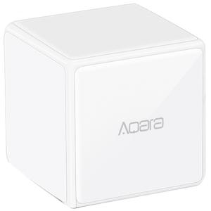

# [LUMI - lumi.sensor_cube.aqgl01](https://www.aqara.com/en/cube_controller-product.html)



# Description
(MFKZQ01LM) Cube

# Entities
MultistateInput - sensor

AnalogInput - sensor

# Events

## drop

```json
{
    "event_type": "zha_event",
    "data": {
        "unique_id": "0x360d:2:0x0012",
        "device_ieee": "00:15:8d:00:02:4a:49:e0",
        "command": "drop",
        "args": {
            "value": 3
        }
    },
    "origin": "LOCAL",
    "time_fired": "2019-05-08T11:18:08.193250+00:00",
    "context": {
        "id": "07c0fc4e86584b2e9b003e840df633c6",
        "parent_id": null,
        "user_id": null
    }
}
```

## flip

```json
{
    "event_type": "zha_event",
    "data": {
        "unique_id": "0x360d:2:0x0012",
        "device_ieee": "00:15:8d:00:02:4a:49:e0",
        "command": "flip",
        "args": {
            "value": 107,
            "flip_degrees": 90,
            "activated_face": 4
        }
    },
    "origin": "LOCAL",
    "time_fired": "2019-05-08T11:17:57.378127+00:00",
    "context": {
        "id": "b112d7ee8c9d4d0988fa26d5c17b0894",
        "parent_id": null,
        "user_id": null
    }
}
```

## knock

```json
{
    "event_type": "zha_event",
    "data": {
        "unique_id": "0x360d:2:0x0012",
        "device_ieee": "00:15:8d:00:02:4a:49:e0",
        "command": "knock",
        "args": {
            "value": 517,
            "description": "aqara logo facing user upright",
            "activated_face": 6
        }
    },
    "origin": "LOCAL",
    "time_fired": "2019-05-08T11:17:54.882174+00:00",
    "context": {
        "id": "d476538d0a2342079335e26f69ef259d",
        "parent_id": null,
        "user_id": null
    }
}
```

## rotate

```json
{
    "event_type": "zha_event",
    "data": {
        "unique_id": "0x360d:3:0x000c",
        "device_ieee": "00:15:8d:00:02:4a:49:e0",
        "command": "rotate_left",
        "args": {
            "relative_degrees": -11.210000991821289
        }
    },
    "origin": "LOCAL",
    "time_fired": "2019-05-08T11:18:03.072607+00:00",
    "context": {
        "id": "0b3836608b9840959c52a13cce4bc7a9",
        "parent_id": null,
        "user_id": null
    }
}
```

## shake

```json
{
    "event_type": "zha_event",
    "data": {
        "unique_id": "0x360d:2:0x0012",
        "device_ieee": "00:15:8d:00:02:4a:49:e0",
        "command": "shake",
        "args": {
            "value": 0
        }
    },
    "origin": "LOCAL",
    "time_fired": "2019-05-08T11:17:51.081002+00:00",
    "context": {
        "id": "9fdfe852aaa849a6aa1582705ec34c9d",
        "parent_id": null,
        "user_id": null
    }
}
```

## slide

```json
{
    "event_type": "zha_event",
    "data": {
        "unique_id": "0x360d:2:0x0012",
        "device_ieee": "00:15:8d:00:02:4a:49:e0",
        "command": "slide",
        "args": {
            "value": 259,
            "description": "arara logo on bottom",
            "activated_face": 4
        }
    },
    "origin": "LOCAL",
    "time_fired": "2019-05-08T11:18:03.555298+00:00",
    "context": {
        "id": "b73985cb65bd412580c13e850765ca57",
        "parent_id": null,
        "user_id": null
    }
}
```

